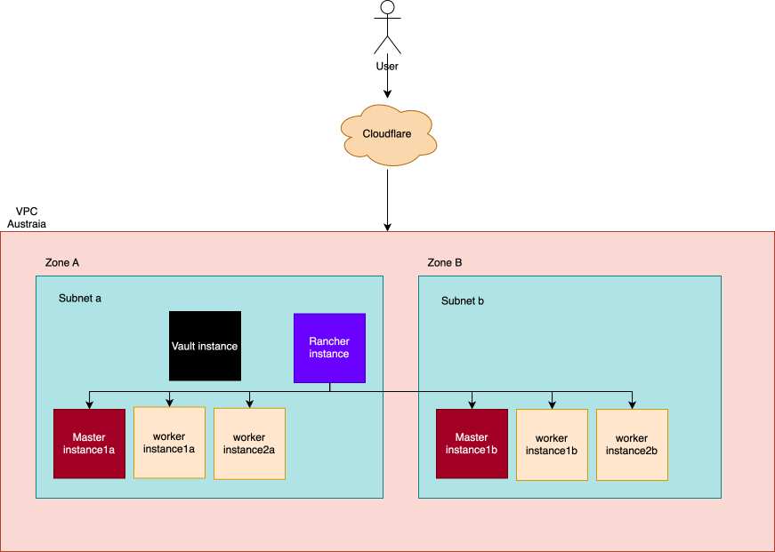
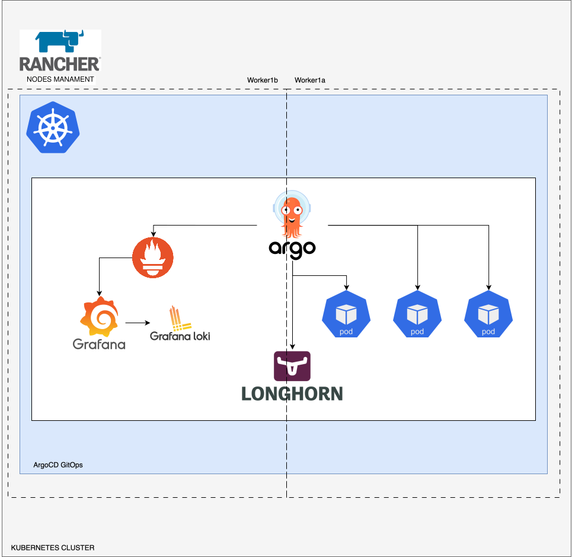

# Weather App - Kubernetes GitOps Infrastructure

Production-ready Kubernetes infrastructure for weather application using ArgoCD, Prometheus monitoring, and automated scaling.

## Architecture Overview

### Infrastructure Components


### Key Features

- **GitOps Deployment**: ArgoCD manages all deployments from Git
- **Multi-Environment**: Dev, UAT, Production with environment-specific configs
- **Auto-Scaling**: HPA scales based on CPU/Memory (30% CPU threshold in prod)
- **Monitoring**: Full observability with Prometheus, Grafana, Loki, Tempo
- **Secret Management**: External Secrets Operator with Vault integration
- **Storage**: Longhorn for persistent volumes
- **Database**: PostgreSQL with automated migrations

## Setup Instructions

### Prerequisites

- Kubernetes cluster (k3s, RKE2, or any K8s distribution)
- kubectl configured
- Helm 3.x
- ArgoCD CLI (optional)
- Git repository access

### 1. Initial Cluster Setup

```bash
# Initialize cluster with ArgoCD
./01-init-cluster.bash

# This installs:
# - ArgoCD
# - Metrics Server
# - Ingress NGINX
```

### 2. Create Secrets

```bash
# Create required secrets in Vault or Kubernetes
./02-create-secrets.bash

# Required secrets:
# - WEATHER_API_KEY (Weather API key)
# - DATABASE_URL (PostgreSQL connection string)
```

### 3. Bootstrap Applications

```bash
# Deploy all applications via ArgoCD
helm install bootstrap ./02-bootstrap \
  -f ./02-bootstrap/values.yaml \
  -f ./02-bootstrap/values-production.yaml \
  -n argocd

# This creates ArgoCD Applications for:
# - Weather app (all environments)
# - PostgreSQL
# - Prometheus stack
# - Loki & Tempo
# - External Secrets
# - Longhorn
```

### 4. Verify Deployment

```bash
# Check ArgoCD applications
argocd app list

# Check all pods
kubectl get pods -A

# Check weather app specifically
kubectl get pods -n weather-production
kubectl get hpa -n weather-production
kubectl get ingress -n weather-production
```

## Usage Instructions

### Accessing Services

**Production URLs:**

- Weather App: http://weather.thebrainsurf.site
- ArgoCD: http://argocd.thebrainsurf.site
- Grafana: http://grafana.thebrainsurf.site
- Prometheus: http://prometheus.thebrainsurf.site
- Longhorn: http://longhorn.thebrainsurf.site

**Dev URLs:**

- Weather App: http://weather-dev.thebrainsurf.site

### Weather App Endpoints

```bash
# Health check
curl http://weather.thebrainsurf.site/health

# Metrics (Prometheus format)
curl http://weather.thebrainsurf.site/metrics

# Get weather data
curl http://weather.thebrainsurf.site/get-weather
```

### Monitoring

```bash
# View metrics
kubectl top pods -n weather-production

# Check HPA status
kubectl get hpa -n weather-production
kubectl describe hpa weather-production -n weather-production

# View logs
kubectl logs -n weather-production -l app=weather-app --tail=100 -f

# Check Prometheus targets
kubectl port-forward -n monitoring svc/prometheus-kube-prometheus-prometheus 9090:9090
# Open http://localhost:9090/targets
```

### Manual Scaling

```bash
# Scale manually (overrides HPA temporarily)
kubectl scale deployment weather-production -n weather-production --replicas=3

# HPA will take over after a few minutes
```

### Load Testing

```bash
# Install hey (HTTP load generator)
go install github.com/rakyll/hey@latest

# Run load test
hey -z 2m -c 100 -q 10 https://weather.thebrainsurf.site/

# Watch HPA scale
kubectl get hpa -n weather-production -w
```

## Failure Scenario Handling

### a. API Crashes During Peak Hours

**Symptoms:**

- 503 errors
- High error rate in logs
- Pods restarting frequently

**What to Do:**

1. **Check HPA is scaling:**

   ```bash
   kubectl get hpa -n weather-production
   kubectl describe hpa weather-production -n weather-production
   ```

2. **Verify resource limits:**

   ```bash
   kubectl top pods -n weather-production
   ```

3. **Check pod logs for errors:**

   ```bash
   kubectl logs -n weather-production -l app=weather-app --tail=100
   ```

4. **Temporary fix - increase replicas:**

   ```bash
   # Update values-production.yaml
   autoscaling:
     minReplicas: 5
     maxReplicas: 10

   # Commit and push
   git add . && git commit -m "Increase HPA limits" && git push
   ```

5. **Long-term fix:**
   - Lower CPU threshold (currently 30%)
   - Increase resource limits
   - Add more nodes to cluster
   - Implement caching

---

### b. Worker Fails and Infinitely Retries

**Symptoms:**

- CrashLoopBackOff status
- Restart count increasing
- Error logs repeating

**What to Do:**

1. **Check pod status:**

   ```bash
   kubectl get pods -n weather-production
   kubectl describe pod <pod-name> -n weather-production
   ```

2. **View logs to identify issue:**

   ```bash
   kubectl logs <pod-name> -n weather-production --previous
   ```

3. **Immediate fix - delete failing pod:**

   ```bash
   kubectl delete pod <pod-name> -n weather-production
   ```

4. **If issue persists, rollback:**

   ```bash
   argocd app rollback weather-production
   # or
   kubectl rollout undo deployment/weather-production -n weather-production
   ```

5. **Long-term fix:**
   - Add exponential backoff in application code
   - Implement circuit breaker pattern
   - Add proper error handling
   - Set `restartPolicy: OnFailure` for Jobs

---

### c. Bad Deployment is Released

**Symptoms:**

- Application not responding
- High error rates after deployment
- Failed health checks

**What to Do:**

1. **Immediate rollback via ArgoCD:**

   ```bash
   argocd app rollback weather-production
   ```

2. **Or rollback via kubectl:**

   ```bash
   kubectl rollout undo deployment/weather-production -n weather-production
   ```

3. **Check rollout history:**

   ```bash
   kubectl rollout history deployment/weather-production -n weather-production
   ```

4. **Rollback to specific revision:**

   ```bash
   kubectl rollout undo deployment/weather-production -n weather-production --to-revision=2
   ```

5. **Verify rollback:**

   ```bash
   kubectl rollout status deployment/weather-production -n weather-production
   kubectl get pods -n weather-production
   ```

6. **Fix in Git:**
   - Revert the bad commit
   - Fix the issue
   - Test in dev/uat first
   - Deploy to production

**Prevention:**

- Always test in dev/uat before production
- Use canary deployments
- Implement automated testing in CI/CD
- Set up proper health checks

---

### d. Kubernetes Node Goes Down

**Symptoms:**

- Pods stuck in Pending or Unknown state
- Node shows NotReady status
- Services partially unavailable

**What to Do:**

1. **Check node status:**

   ```bash
   kubectl get nodes
   kubectl describe node <node-name>
   ```

2. **Check pod distribution:**

   ```bash
   kubectl get pods -n weather-production -o wide
   ```

3. **Rancher HA will automatically handle:**
   - **Master nodes**: If master in Zone A fails, Zone B master is promoted immediately
   - **Worker nodes**: Pods automatically reschedule to healthy workers
   - **Cross-zone failover**: Works across different zones, VPCs, or cloud providers
   - **No manual intervention needed** as long as Rancher control plane is healthy

4. **Verify cluster health in Rancher:**
   - Check Rancher UI for node status
   - Verify etcd cluster health (master nodes)
   - Confirm pods rescheduled successfully

5. **If pods stuck, force delete:**

   ```bash
   kubectl delete pod <pod-name> -n weather-production --force --grace-period=0
   ```

6. **If PVC stuck on dead node:**

   ```bash
   # Check PVC status
   kubectl get pvc -n weather-production

   # Longhorn handles failover automatically with replicas across zones
   ```

7. **Optional - Remove dead node from cluster:**

   ```bash
   # Drain node first (if accessible)
   kubectl drain <node-name> --ignore-daemonsets --delete-emptydir-data

   # Delete from cluster
   kubectl delete node <node-name>

   # Remove from Rancher UI
   ```

**High Availability Architecture:**




**Prevention:**

- **Master nodes**: Deploy across multiple zones (minimum 3 for etcd quorum)
- **Worker nodes**: Distribute across zones/VPCs/cloud providers
- **Pod anti-affinity**: Ensure pods spread across different zones
- **Longhorn storage**: Configure replicas across zones
- **Rancher HA**: Keep Rancher control plane highly available

**Current Setup:**

- Production runs 2-5 pods distributed across zones
- HPA ensures pods are spread across available nodes
- Longhorn provides distributed storage with zone-aware replicas
- Rancher manages multi-zone cluster with automatic failover
- Master nodes in multiple zones for control plane HA

---

## Troubleshooting

### ArgoCD Out of Sync

```bash
# Check diff
argocd app diff weather-production

# Force sync
argocd app sync weather-production --force

# Refresh app
argocd app get weather-production --refresh
```

### HPA Not Scaling

```bash
# Check metrics-server
kubectl top nodes
kubectl top pods -n weather-production

# Check HPA events
kubectl describe hpa weather-production -n weather-production

# Verify ServiceMonitor
kubectl get servicemonitor -n weather-production
```

### Prometheus Not Scraping Metrics

```bash
# Check ServiceMonitor selector
kubectl get servicemonitor weather-production -n weather-production -o yaml

# Check Service labels
kubectl get svc weather-service -n weather-production --show-labels

# Check Prometheus targets
kubectl port-forward -n monitoring svc/prometheus-kube-prometheus-prometheus 9090:9090
# Visit http://localhost:9090/targets
```

### Database Connection Issues

```bash
# Check PostgreSQL pod
kubectl get pods -n postgresql

# Check secrets
kubectl get secret weather-production-secret -n weather-production -o yaml

# Test connection from pod
kubectl exec -it <weather-pod> -n weather-production -- sh
# Inside pod:
env | grep DATABASE
```

## Configuration Files

### Key Files Structure

```
.
├── 01-init/                          # ArgoCD bootstrap
├── 02-bootstrap/                     # Application bootstrap
├── 03-argocd-apps/
│   ├── applications/                 # ArgoCD Application definitions
│   │   └── app-weather.yaml         # Weather app ApplicationSet
│   └── manifests/
│       └── app-weather/             # Weather app Helm chart
│           ├── templates/
│           │   ├── deployment.yaml  # Deployment (no replicas field)
│           │   ├── hpa.yaml         # HorizontalPodAutoscaler
│           │   ├── ingress.yaml     # Ingress (no rate limit)
│           │   ├── svc-clusterip.yaml
│           │   ├── servicemonitor.yaml
│           │   ├── configmap.yaml
│           │   └── externalsecret.yaml
│           ├── values.yaml          # Base values
│           ├── values-dev.yaml      # Dev overrides
│           ├── values-uat.yaml      # UAT overrides
│           └── values-production.yaml # Production overrides
```

### Environment-Specific Values

**Dev:**

- 1 pod (HPA: min=1, max=1)
- Low resources (50m CPU, 64Mi RAM)
- Domain: weather-dev.thebrainsurf.site

**UAT:**

- 1-3 pods (HPA enabled)
- Medium resources
- Domain: weather-uat.thebrainsurf.site

**Production:**

- 2-5 pods (HPA enabled)
- High resources (100m-500m CPU, 128Mi-512Mi RAM)
- CPU threshold: 30% (easy to test scaling)
- Domain: weather.thebrainsurf.site

## Contributing

1. Create feature branch from `dev`
2. Make changes and test locally
3. Push to dev branch → deploys to dev environment
4. Create PR to `uat` → deploys to UAT
5. After testing, merge to `production`
